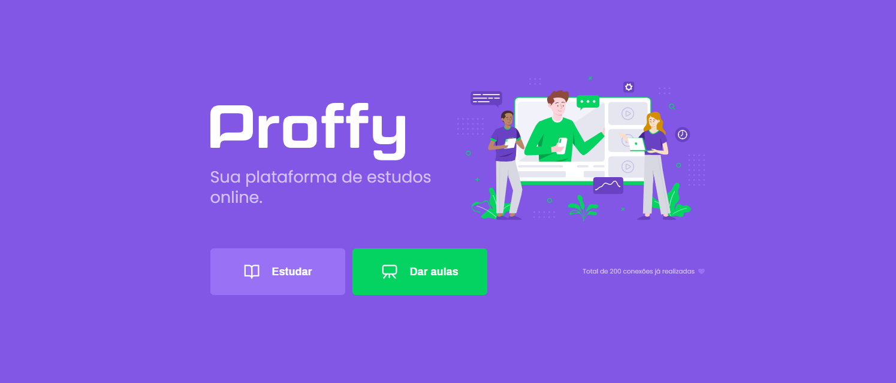
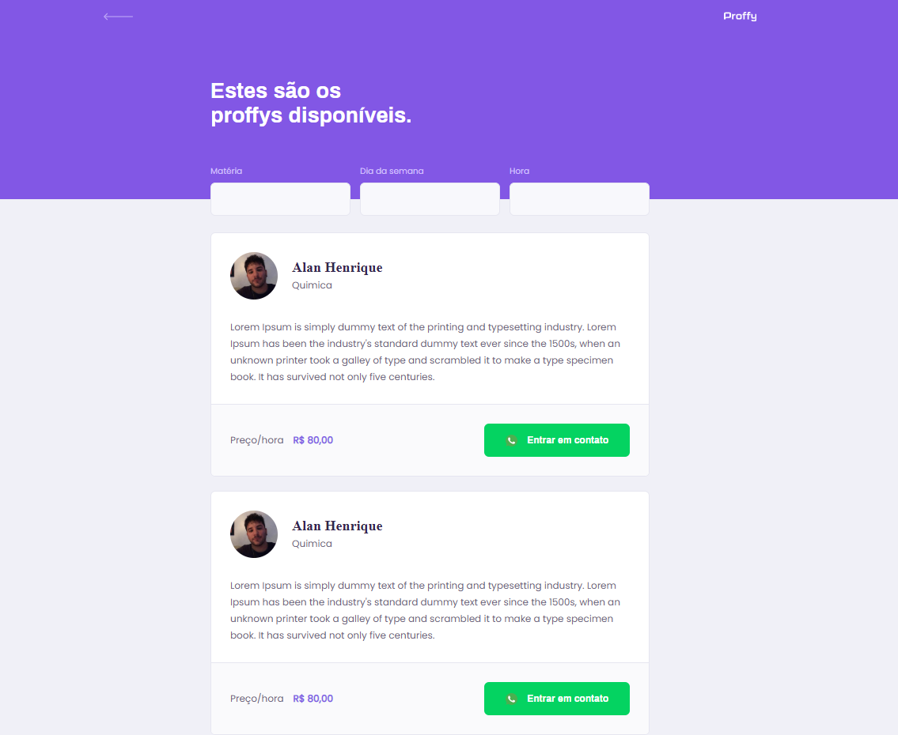

<h3 align="center">
  Frontend aplicativo Proffy - Desenvolvido durante a semana Next Level 2</h3>

“Só deseje as coisas as quais você está disposto a lutar”!</blockquote>

  <a href="https://github.com/alanhrc">
    </img>
  </a>
  <!-- </img>
  <a aria-label="Versão do Node" href="https://github.com/nodejs/node/blob/master/doc/changelogs/CHANGELOG_V12.md#12.16.1">
    </img>
  </a> -->
  <a aria-label="Versão do Typescript" href="#">
    </img>
  </a>
  </img>
  <!-- <a href="https://github.com/alanhrc/GoBarberBootcampBackend/stargazers">
    </img>
  </a> -->

 

  <!-- <a href="#rocket-sobre-o-desafio">Sobre o desafio</a>&nbsp;&nbsp;&nbsp;|&nbsp;&nbsp;&nbsp; -->
  <a href="#memo-licença">Licença</a>

## :memo: Licença

Esse projeto está sob a licença MIT. Veja o arquivo [LICENSE](LICENSE.md) para mais detalhes.

---

Feito com 💜 by Alan :wave: [Chama no Discord!](https://discordapp.com/invite/#8402)
